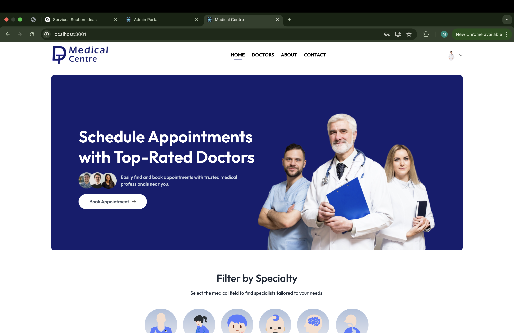
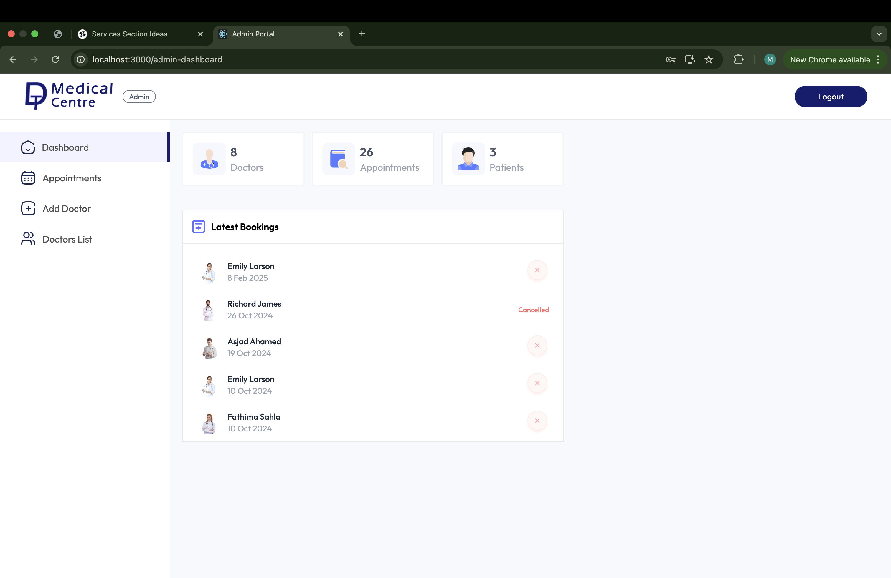

# DT Medical Centre

DT Medical Centre is a full-stack web application built using the MERN stack (MongoDB, Express, React, Node.js) and styled with Tailwind CSS. The application allows users to book medical appointments, filter doctors, and make payments (attending time or online). Doctors and admins have different roles with specific functionalities.

---

## Features

### **User Features:**
- **Book Appointments:** Users can book appointments with doctors.
- **Filter Doctors:** Users can filter doctors based on specialties or availability.
- **Appointment Details:** Users can view their appointment details.
- **Payment Options:** Users can pay either attending time or online.

---

### **Admin Features:**
- **Add Doctors:** Admins can add doctors to the system and manage their profiles.
- **Manage Patients:** Admins can view all patients and their details.
- **View Payments:** Admins can view the payment records for each patient.

---

### **Doctor Features:**
- **Login & Profile Management:** Doctors can log in to their profile, add details, and set up payment methods.
- **Patient Management:** Doctors can view their patients and manage their payment details.
